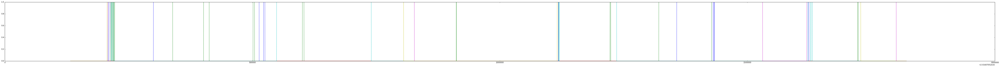
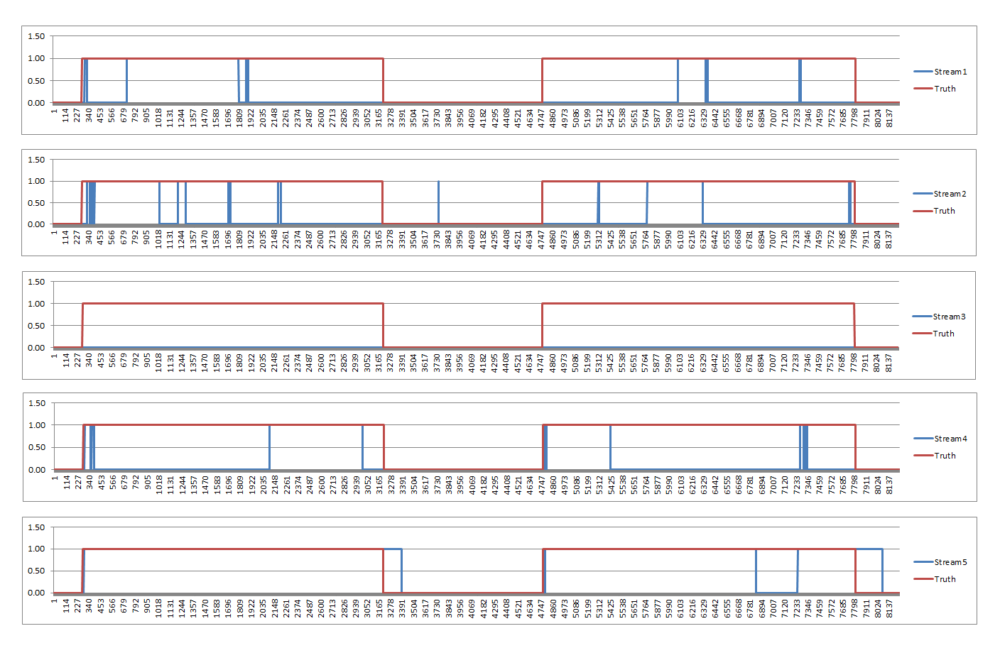
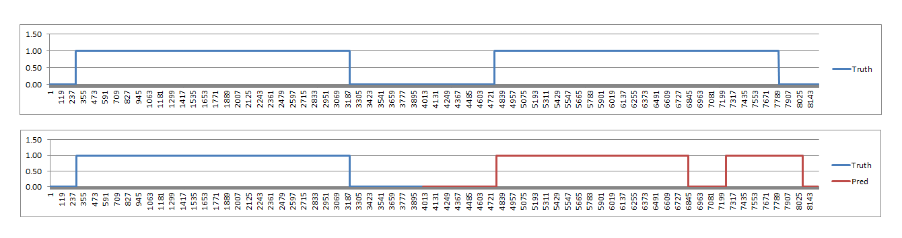

First I would like to read the data from text file and would like to understand the nature and behavior of the data. Since the domain is totally unknown to me, I would like to get a better sence of the domain first.

```python
# all the imports here
import pandas as pd
import numpy as np
import matplotlib.pyplot as plt
import numpy.core.defchararray as npdef
from IPython.display import Image
from keras.models import Sequential
from keras.layers import Dense
from keras.layers import Flatten
from keras.layers import LSTM
from keras.layers.embeddings import Embedding
from keras.preprocessing import sequence
from sklearn.metrics import confusion_matrix
from sklearn.linear_model import LogisticRegression
```


```python
# reading dataset
with open("sample_data.txt") as dataFile:
    dataset = np.array([np.array(data.split(",")) for data in dataFile if len(data) > 1])
dataset = np.char.strip(dataset)

print(dataset[:, :])
```

    [['Timestamp' 'Stream1' 'Stream2' ... 'Stream4' 'Overall' 'Truth']
     ['[2016-07-05 20:01:32.470]' 'False' 'False' ... 'False' 'False' 'False']
     ['[2016-07-05 20:01:32.580]' 'False' 'False' ... 'False' 'False' 'False']
     ...
     ['[2016-07-05 20:18:21.111]' 'False' 'False' ... 'False' 'False' 'False']
     ['[2016-07-05 20:18:21.211]' 'False' 'False' ... 'False' 'False' 'False']
     ['[2016-07-05 20:18:21.356]' 'False' 'False' ... 'False' 'False' 'False']]
    
I would like to map the element 'True' into 1 and 'False' into 0. It would help later.

```python
dataset[dataset == 'True'] = 1
dataset[dataset == 'False'] = 0

print(dataset[1: , :])
```

    [['[2016-07-05 20:01:32.470]' '0' '0' ... '0' '0' '0']
     ['[2016-07-05 20:01:32.580]' '0' '0' ... '0' '0' '0']
     ['[2016-07-05 20:01:32.727]' '0' '0' ... '0' '0' '0']
     ...
     ['[2016-07-05 20:18:21.111]' '0' '0' ... '0' '0' '0']
     ['[2016-07-05 20:18:21.211]' '0' '0' ... '0' '0' '0']
     ['[2016-07-05 20:18:21.356]' '0' '0' ... '0' '0' '0']]
    


```python
# Converting the datatime string format to int, it might need during plotting!
dataset = npdef.replace(npdef.replace(npdef.replace(npdef.replace(npdef.replace(npdef.replace(dataset, ']', ''), '[', ''), '.', ''), ':', ''), ' ', ''), '-', '')
print(dataset)
```

    [['Timestamp' 'Stream1' 'Stream2' ... 'Stream4' 'Overall' 'Truth']
     ['20160705200132470' '0' '0' ... '0' '0' '0']
     ['20160705200132580' '0' '0' ... '0' '0' '0']
     ...
     ['20160705201821111' '0' '0' ... '0' '0' '0']
     ['20160705201821211' '0' '0' ... '0' '0' '0']
     ['20160705201821356' '0' '0' ... '0' '0' '0']]
    
I want to count the number of positive and negative samples in the dataset

```python
total_ones = (dataset[1:,6]== '1').sum()
total_zeros = (dataset[1:,6]== '0').sum()

print('Total number of samples: ', len(dataset[1:,6]))
print('Total positive samples: ', total_ones)
print('Total negative samples: ', total_zeros)
```

    Total number of samples:  8241
    Total positive samples:  5979
    Total negative samples:  2262
    
I would like to make some visual analysis of the dataset. Specifically I am interested to see if I can get some visual understanding of how input features effect the prediction.

```python
x = dataset[1: , 0].astype(np.float)
y = dataset[1: , 1:].astype(np.int)
plt.figure(figsize=(100, 6))
plt.plot(x, y)
```


    [<matplotlib.lines.Line2D at 0x28780bbec88>,
     <matplotlib.lines.Line2D at 0x28780cb0588>,
     <matplotlib.lines.Line2D at 0x28780cb0a90>,
     <matplotlib.lines.Line2D at 0x287f47ca9e8>,
     <matplotlib.lines.Line2D at 0x287f47caf98>,
     <matplotlib.lines.Line2D at 0x287f47ca320>]




Since it's hard to understand the plot in jupyter, I decided to store the array into csv file and plot them using excel to get a better idea. Below codes are to store the data into csv file and the better plot can be found in the same directory. I am attaching the plots here as well.

```python
np.savetxt("dataset.csv", np.round(dataset[1:, :].astype(np.float), 2), delimiter=",")
```
Below plots show the behavior of each NODE comapring to the truth value. To make it faster, I didn't mention the title, x-axis and y-axis. X-axis represents the time and y-axis represents the 0/1 value.

```python
Image("dataPlot.png")
```





# Visual Analyses
After doing the above visualizations, I have several comments:

1. Stream 3 (Node 2 or Node 3) output seems useless. Doesn't matter what the truth value is, this node always outputs false. Since it doesn't look correct, my inital decision is that I am not going to use this stream 3 feature in my own detection. (The feature names start with stream 1 in the dataset but stream 0 in the visual defination. Though the visual defination and dataset have different feature names, I believe stream 3 is the output of Node 2 in the visual defination!) 

2. The 'overall' feature (I mistakenly mentioned it as stream 5 in the above plot) is much more correlated with the truth value comparing to other streams. 

3. Although the 'overall' feature is better than any other stream, still it coudn't sense a person immediately after entering into the room. That is because none of the nodes were able to detect person immediately. Since the features don't have any pattern of this scenario, I assume there is no way that machine learning algorithm can detect this immediately. It atleast takes 2-3 seconds to detect the person after entering into the room.

4. Same thing happens while a person leave the room, but this time it takes little longer time to determine that the person doesn't exist in the room.

5. I would like to know how many samples are there in total where the truth is positive but all the nodes output negative signal. These samples might mislead the prediction later.

6. Since this is time series data, looks like changing truth values hold for some times and the truth value also depends on the recent part, my inital thought is to use a reccurent neural network for my own detection.

7. But, it looks like the dataset is not big enough for RNN algorithm. It would be interesting to see what kind of result a non-RNN learning algorithm provides. I assume the result will be similar.

8. At the same time, I would like to see how a non machine learning approach performs. Specifially, I want run a simple algorithm on the dataset. For each sample, if any of the feature set has value 'true', I would consider my own detection as true. Otherwise false. (Might be a stupid idea, but just curious!)

9. I would like to compare the ML and non-ML approach!

```python
# dividing into training and testing. Since first half of the data is similar as the second half of the data, 
# I want to train with the first half and test with the second half.
X_train = dataset[1:4000,[1,2,4,5]].astype(np.int)
y_train = dataset[1:4000,6].astype(np.int)
X_test = dataset[4000:,[1,2,4,5]].astype(np.int) 
y_test = dataset[4000:,6].astype(np.int)
```


```python
# using LSTM
model = Sequential()
model.add(Embedding(2, 32, input_length=4))
model.add(LSTM(100))
model.add(Dense(1, activation='sigmoid'))
model.compile(loss='binary_crossentropy', optimizer='adam', metrics=['accuracy'])
print(model.summary())
model.fit(X_train, y_train, epochs=10, batch_size=64)
# Final evaluation of the model
scores = model.evaluate(X_test, y_test, verbose=0)
print("Accuracy: %.2f%%" % (scores[1]*100))

y_pred = model.predict(X_test)
y_pred[y_pred > 0.5] = 1
y_pred[y_pred <= 0.5] = 0
y_pred = y_pred[:,0]

print("Confusion Matrix")
print(pd.crosstab(y_test, y_pred))

precision = pd.crosstab(y_test, y_pred)[1][1] / (pd.crosstab(y_test, y_pred)[1][1] + pd.crosstab(y_test, y_pred)[1][0])
recall = pd.crosstab(y_test, y_pred)[1][1] / (pd.crosstab(y_test, y_pred)[1][1] + pd.crosstab(y_test, y_pred)[0][1])
print("Precision: ", precision)
print("Recall: ", recall)
print("F1 Score: ", (2*precision*recall)/ (precision+recall))
```

    _________________________________________________________________
    Layer (type)                 Output Shape              Param #   
    =================================================================
    embedding_37 (Embedding)     (None, 4, 32)             64        
    _________________________________________________________________
    lstm_84 (LSTM)               (None, 100)               53200     
    _________________________________________________________________
    dense_54 (Dense)             (None, 1)                 101       
    =================================================================
    Total params: 53,365
    Trainable params: 53,365
    Non-trainable params: 0
    _________________________________________________________________
    None
    Epoch 1/10
    3999/3999 [==============================] - 4s 1ms/step - loss: 0.4801 - acc: 0.7872
    Epoch 2/10
    3999/3999 [==============================] - 1s 149us/step - loss: 0.1823 - acc: 0.9317
    Epoch 3/10
    3999/3999 [==============================] - 1s 134us/step - loss: 0.1338 - acc: 0.9520
    Epoch 4/10
    3999/3999 [==============================] - 1s 134us/step - loss: 0.1210 - acc: 0.9520
    Epoch 5/10
    3999/3999 [==============================] - 1s 131us/step - loss: 0.1180 - acc: 0.9520
    Epoch 6/10
    3999/3999 [==============================] - 1s 141us/step - loss: 0.1185 - acc: 0.9520
    Epoch 7/10
    3999/3999 [==============================] - 1s 136us/step - loss: 0.1181 - acc: 0.9520
    Epoch 8/10
    3999/3999 [==============================] - 1s 136us/step - loss: 0.1190 - acc: 0.9520
    Epoch 9/10
    3999/3999 [==============================] - 1s 167us/step - loss: 0.1180 - acc: 0.9520
    Epoch 10/10
    3999/3999 [==============================] - 1s 169us/step - loss: 0.1205 - acc: 0.9520
    Accuracy: 83.92%
    Confusion Matrix
    col_0  0.0   1.0
    row_0           
    0      936   260
    1      422  2624
    Precision:  0.9098474341192788
    Recall:  0.8614576493762311
    F1 Score:  0.884991568296796
    
I would like to mention few things here:

1. Since the result is okay for this dataset, didn't experiment that much with the hyperparameters and the architecure of NN. But, it is necessary to get the best result. But, for this problem, it won't make any difference (tried with some different hyperparameters) and the reason can be found on below results (specifically the non-ml approach.) 

2. Again, since train and test accuracy looks close, I didn't try to plot the error rate of the model against the dataset to determine the model overfitting. But, it is also important to plot the learning curve and see the behavior.

3. Although the accuracy and f1-score look reasonable, this model might fail if we try to predict with a dataset with different kind of pattern. Since the dataset is not that big enough, the model couldn't capture all the different kind of patterns. And, since the testing data is also almost similar to the training data, the testing accuracy looks good.

4. Looks like dataset is not big enough for time series, I assume a non-reccurent algorithm would perform the same. Since we have to deal with binary decision (I mean we have two classes [success: true/false]), I want to see how logistic regression performs.

```python
# using logistic regression
clf = LogisticRegression().fit(X_train, y_train)
y_pred_clf = clf.predict(X_test)
print("Confusion Matrix")
print(pd.crosstab(y_test, y_pred_clf))
print("Accuracy", clf.score(X_test, y_test))

precision_clf = pd.crosstab(y_test, y_pred_clf)[1][1] / (pd.crosstab(y_test, y_pred_clf)[1][1] + pd.crosstab(y_test, y_pred_clf)[1][0])
recall_clf = pd.crosstab(y_test, y_pred_clf)[1][1] / (pd.crosstab(y_test, y_pred_clf)[1][1] + pd.crosstab(y_test, y_pred_clf)[0][1])
print("Precision: ", precision_clf)
print("Recall: ", recall_clf)
print("F1 Score: ", (2*precision_clf*recall_clf)/ (precision_clf+recall_clf))

```

    Confusion Matrix
    col_0    0     1
    row_0           
    0      936   260
    1      422  2624
    Accuracy 0.8392267798208393
    Precision:  0.9098474341192788
    Recall:  0.8614576493762311
    F1 Score:  0.884991568296796
    


```python
# plot prediction
plotReal = np.concatenate([y_train,y_test])
plotPred = np.concatenate([y_train,y_pred])
storeForPlotting = np.array([plotReal, plotPred])
# print(np.transpose(storeForPlotting))
np.savetxt("plotPred.csv", np.transpose(storeForPlotting), delimiter=",")
```


```python
Image("PredPlot.png")
```





Above plots show the testing truth data and prediction data. If we compare this plots with the original data plots (5 figures together), the prediction is exactly same as the 'overall' feature. I assume, this is because, the 'overall' feature contains information from all other streams.

```python
# Non ML Approach (Stupid approach)
# I want run a simple algorithm on the dataset. 
# For each sample, if any of the feature set has value 'true', I would consider my own detection as true. 
# I assume the prediction will be similar

st_pred = []
for arr in X_test:
    if arr[0] == 1 or arr[1] == 1 or arr[2] == 1 or arr[3] == 1:
        st_pred.append(1)
    else: 
        st_pred.append(0)

st_pred = np.array(st_pred)
print("Confusion Matrix")
print(pd.crosstab(y_test, st_pred))

precision_st = pd.crosstab(y_test, st_pred)[1][1] / (pd.crosstab(y_test, st_pred)[1][1] + pd.crosstab(y_test, st_pred)[1][0])
recall_st = pd.crosstab(y_test, st_pred)[1][1] / (pd.crosstab(y_test, st_pred)[1][1] + pd.crosstab(y_test, st_pred)[0][1])
print("Precision: ", precision_st)
print("Recall: ", recall_st)
print("F1 Score: ", (2*precision_st*recall_st)/ (precision_st+recall_st))
```

    Confusion Matrix
    col_0    0     1
    row_0           
    0      936   260
    1      422  2624
    Precision:  0.9098474341192788
    Recall:  0.8614576493762311
    F1 Score:  0.884991568296796
    
That's what I assumed! 
So, I conclude like this-
Because of not having enough feature information, the ML algorithms and non-ML (condition based simple algorithm) performed same way.